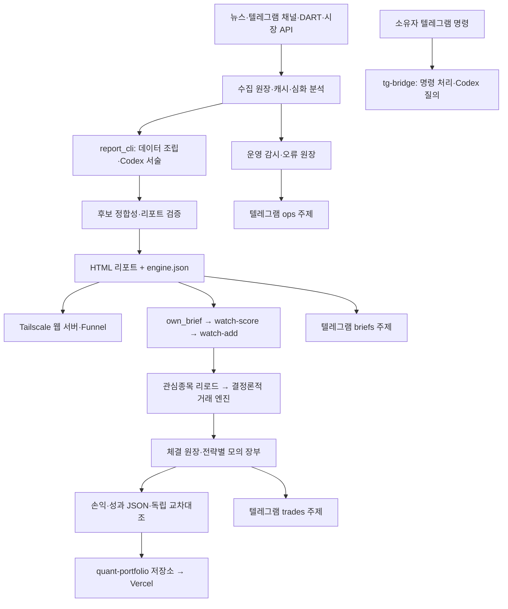

# Codex 운영 인수인계

2026-09-13(PDT) / 2026-09-14(KST) 점검. 예전 착수보고서와 일정이 다르면
이 문서의 실측과 현재 `server/crontab.txt`, systemd 유닛을 우선한다.

## 운영 구조

- EC2: `ubuntu@100.87.129.113`, 저장소 `/home/ubuntu/quant_trading_kiwoom`.
- 서버 시간은 `Asia/Seoul`. 로컬 Mac의 날짜와 다를 수 있다.
- `quant-engine.service`는 paper 모드. Codex 전환은 실거래 전환을 의미하지 않는다.
- 시세는 키움 웹소켓/REST와 Toss, 주문 어댑터는 Toss. 분석과 주문 실행은 분리한다.
- 웹 서버는 `market-report-web.service`, Tailscale 주소의 8899 포트에서 `out/`을 제공한다.
  공개 리포트 기준 URL은 `https://ip-172-31-63-20.tailfee6e9.ts.net`이다.
- 포트폴리오 웹사이트는 [Quant Portfolio](https://quant-portfolio-eta.vercel.app),
  별도 `EricSeoungminKim/quant-portfolio` 저장소다.
  EC2의 `publish_portfolio.sh`가 검증한 `performance.json`만 복사·push하고 Vercel이 배포한다.
- 알림 봇은 `@MR_TRADY_BOT`, 명령 봇은 기존 `@claude_aws_trade_bot`이다.
  봇 사용자명과 실제 답변 엔진은 별개다. 기존 대화방 연결을 유지한다.
- 텔레그램 주제 매핑은 `data/state/tg_lanes.json`: trades / control / briefs / ops / intel.
  봇 API의 `getUpdates`를 별도로 실행하면 운영 봇과 충돌할 수 있으므로 점검에 쓰지 않는다.

## 주요 일정 (KST)

| 시각 | 작업 |
| --- | --- |
| 30분마다 | KR/US 뉴스 및 텔레그램 채널 수집 |
| 05:00 / 17:30 | KR / US 뉴스 심화 분석 |
| 06:48 | Private Banker 읽기 전용 실계좌 진단 |
| 07:05 / 평일 13:25 | DART 공시 수집 |
| 07:30 기동, 07:35부터 빌드 | KR 개장 전 리포트, 목표 08:00 |
| 08:05 / 08:12 / 08:27 | KR 관심종목 초기화 / 자동 편입 / 엔진 리로드 |
| 14:10 | KR 오후 리포트 빌드 |
| 14:52 | KR 오후 리포트 후보 자동 편입 |
| 15:35 / 화–토 06:10 | KR / US 세션 손익 |
| 16:15 / 화–토 06:20 | 공개 성과 JSON 생성 |
| 16:25 / 화–토 06:25 | 포트폴리오 검증 후 게시 |
| 16:55 / 화–토 06:55 | KR / US 종합 WRAP |
| 19:30 기동 | US 리포트: 목표 20:00(서머타임) / 21:00(표준시) |
| 21:40 / 21:50 / 22:10 | US 관심종목 초기화 / 자동 편입 / 엔진 리로드 |

리포트 셸은 목표 시각 25분 전부터 빌드를 시작한다. 실제 발행 시각은 빌드
종료 시각에 따른다. 휴장일은 리포트를 만들지 않고 다음 개장일 안내를 보낸다.
`report_cli when --market KR|US`와 타이머가 날짜별 기준이다.

**09-14 현재 공개 포트폴리오 게시 두 작업은 소유자 공개 승인 대기 중이다.**
자동 승인 검토가 537왕복 성과 JSON의 GitHub/공개 사이트 게시를 거절했다.
`server/crontab.txt`의 `PUBLICATION_HOLD` 두 줄만 보류했으며, 성과 생성은 계속된다.
승인 후 그 두 접두를 제거하고 배포해 일정을 복원한다. 승인 전에 복원하지 않는다.

## 키와 Codex 인증

`.env.local` 내용을 표시하거나 키를 프롬프트·로그에 넣지 않는다. 기존
`quant.adapters.env.get_key()`로 필요한 요청을 수행하고 HTTP/업무 상태만 확인한다.

**DART와 OpenDART는 이 프로그램에서 같은 인증키다.** 모든 수집 코드는
`DART_API_KEY`를 사용한다. `OPENDART_API_KEY`는 사용되지 않던 예제 항목이었다.
EC2의 기존 `DART_API_KEY`로 공시 목록 API를 호출해 HTTP 200, 업무 상태 `000`,
공시 3건을 확인했다. 두 번째 키를 등록할 필요가 없다.

EC2에는 공식 OpenAI 릴리스 `codex-cli 0.154.0` Linux ARM 바이너리를 설치하고
GitHub 릴리스의 SHA-256 digest를 대조했다. 위치는 `~/.local/bin/codex`.
기존 ChatGPT 로그인 캐시를 SSH로 전달했고 `codex login status` 및 실제
비대화형 요청의 성공을 확인했다. 인증 파일은 `~/.codex/auth.json`, 권한 600이며
저장소와 분리한다. 인증 값은 문서에 기록하지 않는다.
Telegram 읽기 도구와 웹검색에는 같은 공식 릴리스의 `codex-code-mode-host`와
`bwrap`도 필요하다. 각각 배포 해시를 대조해 `~/.local/bin/`에 설치한다.
브리지와 웹검색 helper만 실행 호스트를 켜며, 읽기 전용 sandbox와 승인 거부를
유지한다. 도구 없는 리포트 서술에서는 호스트도 끈다.
EC2에서는 bwrap의 loopback 생성이 `Operation not permitted`로 실패했다.
Linux 브리지는 `features.use_legacy_landlock=true`로 동일한 읽기 전용 정책을
적용한다. 실제 샌드박스에서 저장소 파일 읽기는 성공하고 임시 파일 쓰기와
직접 TCP 연결은 `PermissionError`로 차단되는 것을 확인했다.

텍스트 서술·Telegram 질의·JSON 분석은 Codex를 우선 사용한다. OpenRouter는
실패 시 무료 폴백과 기존 Telegram 사진 해석에 남는다. JSON 분석(ai-trader,
promotion-debate, risk-review)의 기존 출력 검증·승인 조건은 유지한다.

공식 문서: [비대화형 실행](https://learn.chatgpt.com/docs/non-interactive-mode),
[서버 인증](https://learn.chatgpt.com/docs/auth).

## 이번 장애의 실측

- Claude CLI가 조직의 구독 접근 차단 오류를 반환해 AI 작업이 반복 실패했다.
  OpenRouter 무료 폴백은 일부 응답했지만 지연·실패가 있었다.
- US 09-08부터, KR 09-09부터 개장 전 리포트가 후보 정합성 검증에서 중단됐다.
  검증기가 표시용 `bearish_markers`의 가격 급락 경고까지 악재 뉴스로 간주했다.
  그러나 09-07 확정 정책과 기존 회귀 테스트는 가격 급락의 거부권을 `RANK`에만
  적용하며, 별도의 뉴스 근거가 있으면 `NEWS` 후보를 허용한다. 정책을 바꾸지 않고
  뉴스 악재 항목을 명시적으로 분리해 검증해야 한다. 가격 경고는 계속 표시한다.
- 기존 실패 알림의 마지막 3줄은 버퍼링 때문에 실제 오류 대신 정상 진행 문구였다.
- 리포트 셸은 공통 알림 함수를 우회해 지정된 포럼 주제로 라우팅되지 않았다.
- 포트폴리오 게시가 09-08 이후 거래 건수 대조 오류로 중단됐다.
- 기존 텔레그램 예외 로그에 인증 토큰을 포함한 URL이 남는 결함이 있었다.
  새로운 로그에 원문 URL을 남기지 않아야 한다. 과거 로그는 비밀정보로 취급한다.
  이번 점검의 pytest 실패 비교 출력에도 `OPENROUTER_API_KEY` 값이 한 번 포함됐다.
  테스트 환경 키와 실제 `narrate.get_key`·기본 HTTP 전송을 격리해 재노출을 막았지만,
  이미 남은 출력의 삭제나 키 교체는 수행하지 않았다. 노출된 키는 교체를 권한다.
- Mac 오프사이트 백업은 마지막 성공이 12일 전이었다. 기존 LaunchAgent가 이전
  체크아웃을 가리켜 현재 `Quant_Trading` 경로로 바꾸고 로그인 셸 의존을 제거했다.
  재수신 후 34개 중 30개는 검증 통과했지만, 09-02~09-05 번들 4개에서 내부
  heartbeat/spread 파일과 매니페스트의 크기·해시 불일치를 확인했다. 네 번들의
  SHA-256은 EC2와 Mac에서 같아 전송 문제가 아니었다. 가변 파일을 매니페스트와
  tar에 따로 읽던 과거 생성 경합이며, 현재 생성기는 이미 단일 읽기로 수정돼 있다.
  네 원본은 양쪽 백업 경로의 `quarantine/2026-09-14/`로 옮기고 해시·오류를
  `inventory.json`에 보존했다. 격리본이 기존 검증기에서 여전히 실패함도 확인했다.
  변경하지 않은 `backup_pull.sh`로 정상 번들 30개를 전부 검증한 뒤 양쪽
  `LAST_PULL`이 `2026-09-13T17:30:10Z`로 갱신됐다. 격리본은 복구 가능한
  정상 백업으로 간주하지 않는다.
- `warehouse-ingest`는 09-11~09-12 실제 성공 로그가 있다. 주말에 최근 성공
  시간 문턱을 넘긴 경보와 실제 실행 실패를 구분해야 한다. `frgn_flow` 신선도와
  미계측 `ops-judge` 경보도 원본 진단에서 확인했다.

점검에서 DART, 두 봇의 `getMe`·포럼 `getChat`, Toss 종목정보 API는 정상이었다.
KR 09-08 리포트와 KR 09-11 오후 리포트는 HTTP 200, US 09-11 리포트 및
엔진 JSON은 HTTP 404였다. 서비스의 `active` 상태만으로 발행 성공을 판정하면 안 된다.

## 재확인 순서

1. `git log -8`, 배포 SHA, `systemctl show`와 실제 타이머를 대조한다.
2. `data/report.log`의 해당 실행, `out/` 산출물, 공개 URL 상태를 확인한다.
3. `data/ledger/notify_sent.jsonl`와 `notify_failures.jsonl`에서 발송 결과를 확인한다.
4. `codex login status`, 도구 없는 짧은 실제 요청으로 AI 인증을 확인한다.
5. 포트폴리오는 `validate-performance`와 `performance-xcheck`를 모두 통과시킨다.
6. 수정 후 전체 pytest, 아키텍처 검사, donchian 합성 데이터 스모크,
   `quant.apps.report_cli --help`를 실행한다. 합성 스모크의 수익은 전략 성과가 아니다.

코드 수리·배포·재검증 결과는 `docs/vault/변경기록.md`에 기록한다.

## 인수 검증의 한계

- 격리한 EC2 코드·데이터 사본으로 09-14 KR 리포트를 실제 생성했다: 589.6초,
  exit 0, HTML·엔진 JSON·후보 목록 생성. 기존 720초 제한 안에 완료됐고
  `after_hours` 한 소스는 결측으로 표시됐다. 공개 발행과 운영 성공 계측은
  이 사전 검증에서 하지 않았다. 산문 숫자 검증 경고도 원본 로그에 보존했다.
- 같은 방식의 US 리포트도 472.2초에 exit 0으로 HTML·엔진 JSON·후보 목록을
  생성했다. 두 검증 모두 실제 API와 Codex를 사용했고 기존 720초 이내였다.
- 배포 후 실제 애플리케이션 경로의 JSON·Telegram 산문·일회성 파일 조회를
  15.4초에 확인했다. 웹검색 전용 helper는 공식 OpenAI 페이지를 실제 웹 도구로
  조회한 이벤트와 응답 출처를 대조했다. 수동 Telegram 메시지는 보내지 않았다.
  같은 호출은 브리지와 동일한 400M/50% systemd 제한에서도 18.4초에 통과했다.
- 다음 예약 시각의 실제 Telegram 도착은 아직 관찰하지 않았다. 사전 리포트
  생성 성공과 예약 발송 성공을 구분한다.
- 로컬 전체 테스트의 기존 실패 14건은 수정 전 HEAD의 별도 사본에서도
  그대로 재현됐다(14 실패/46 통과): 12건은 고정된 09-06 테스트 데이터의
  생성 시각이 36시간 신선도 기준을 넘었고, 1건은 PDT/UTC 날짜 기대값 차이,
  1건은 휴장 캘린더 공급자 없이 평일 시간표로 대체된 경우다. 실제 로컬
  Toss 요청은 IP 허용목록에서 403이었으며 EC2의 요청은 성공했다.
  운영 검증기를 약화시키거나 테스트 날짜를 바꿔 이 실패를 숨기지 않았다.
